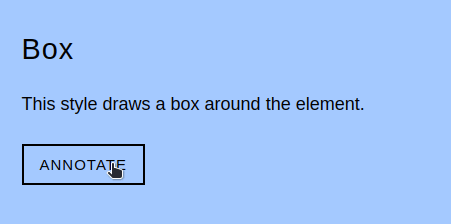

Purescript wrapper for Rough Notation, a library to display hand-drawn, animated annotations on a web page.

This package requires that [Rough Notation](https://www.npmjs.com/package/rough-notation) is installed.

To see these annotations in action, use the [Rough Notation](roughnotation.com) website or see [#Examples](#examples) in this readme

# Getting Started
1.  Install aff with Spago: `spago install aff`
2. Install `rough-notation` from npm: `npm i rough-notation`


# Quick Start

## Creating an annotation

When creating an annotation, you need to provide:
- the `element` to be annotated,
- the `annotationType` to be displayed, and
- additional `config`

The annotation can be shown, hidden, and removed

```purescript
import RoughAnnotation (annotate)

main :: Effect Unit
main = launchAff_ do
  annotation <- annotate element config
  showAnnotation annotation
  hideAnnotation annotation
  removeAnnotation annotation
```

## Config Options

It's worth explaining the type of `annotate`, which is the only way to create an annotation.

```purescript
annotate :: forall config rest. Union config rest ConfigRows => Nub ConfigRows ConfigRows => 
  Element -> RoughAnnotationType -> Record config -> Aff Annotation
```

Because `config` is constrained by the `Union` typeclass, our `annotate` function will accept any config that only contains fields from `Config`.

```purescript
type Config =
  { animate :: Boolean
  , animationDuration :: Milliseconds
  , color :: String
  , strokeWidth :: Number
  , padding :: RoughPadding
  , iterations :: Int
  , brackets :: Array BracketType
  , multiline :: Boolean
  , rtl :: Boolean
  }
```

The following are all valid configuration for an `Annotation`:
```purescript
config1 = { animate: false }
config2 = { iterations: 100, color: "red"}
config3 = { animate: true, strokeWidth: 1.0, multiline: false } 
```

### Scheduling annotations

When using `purescript-rough-notation`, all annotations are run inside the `Aff` monad. 


```purescript
-- consider a list of annotations ag :: [Annotation]
let ag = [a1, a2, ..., an]

-- these annotations can be shown in sequence...
traverse_ showAnnotation ag

-- or in parallel...
parTraverse_ showAnnotation ag

-- or with a stagger
sequential $
  forWithIndex_ annotations \i a ->
    parallel $
      delay (Milliseconds (toNumber i * 400.0)) *> showAnnotation a
```


# Documentation
1. Module documentation is published on [Pursuit](pursuit.purescript.org/packages/purescript-rough-notation).
2. Usage examples can be found in the [/test directory](/test).

# Development
### To compile:
`npm install && npm run build`

### Running tests
`npm run tests` builds `test/script.js`
Open `test/index.html` in a browser.


# Examples




